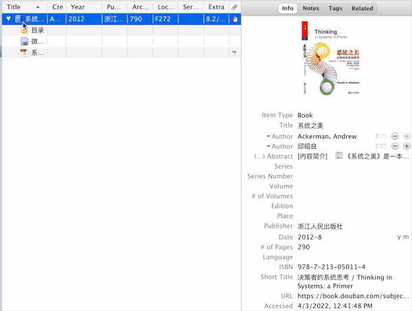
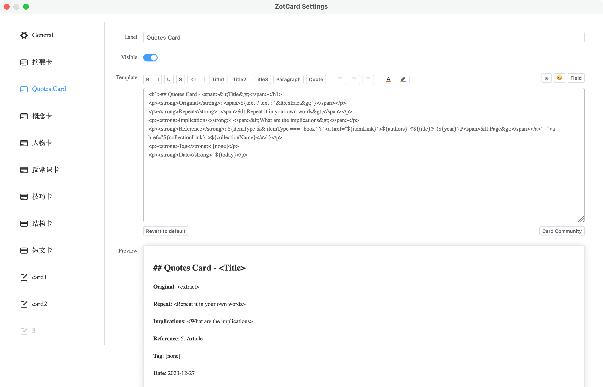
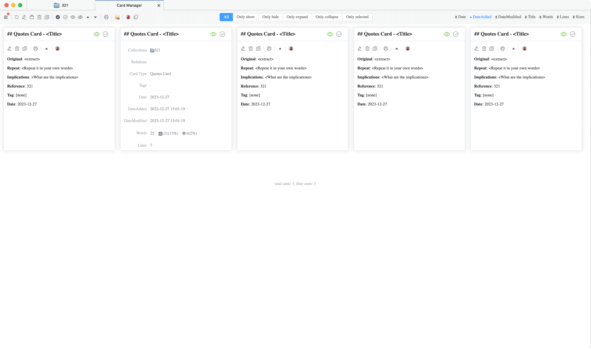
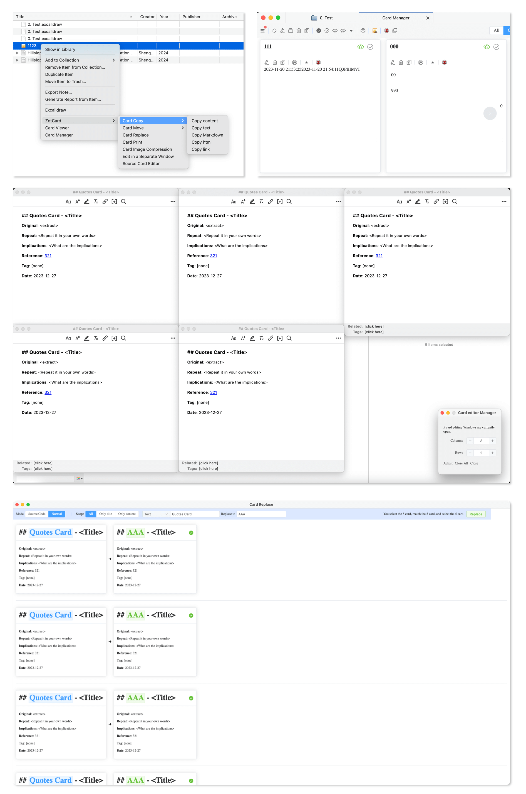
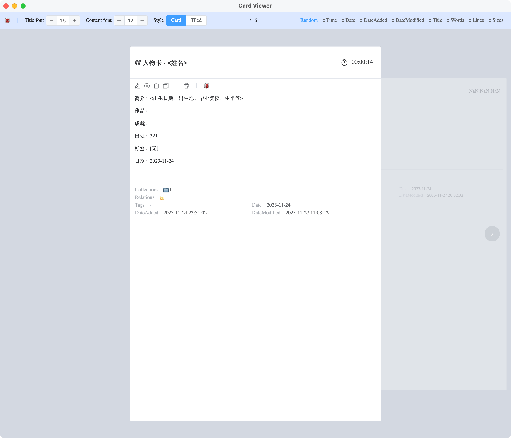
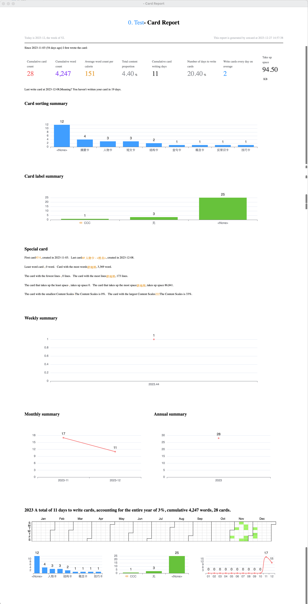

<p align="center">
  
</p>
<p align="center">
  <a href="https://www.zotero.org">
    
  </a>
  <a href="https://github.com/Oz/zotcardx/stargazers">
    
  </a>
  <a href="https://github.com/Oz/zotcardx/releases">
    
  </a>
</p>


English | [简体中文](README_CN.md)

## Introduction
ZotcardX is the maintained edition of the original Zotcard project for the latest Zotero versions. It is a Zotero plug-in for card note-taking, providing card templates (such as concept card, character card, golden sentence card, etc., by default, you can customize other card templates), so you can write cards quickly. In addition, it helps you sort cards and standardize card formats.

## Getting started

- Step 1, download the latest version ZotcardX: [Download](https://github.com/Oz/zotcardx/releases);

- Step 2: Zotero - Tools - Add-ons - ⚙️ - Install Add-on From File... , select the plug-in xpi file;

- Step 3, right-click the item - ZotcardX - summary card, you can quickly create the card according to the template.

  

## Video
- [bilibili](https://space.bilibili.com/404131635)

## Features
- Fast card building: Preset card template, support custom card module.

  

- Card management: Basic card operation, batch operation edit, copy, delete, move, print  and so on.

  

  

- Read card: Randomly read the card, you can also count the time of reading the card.

  

- Card report: Statistics of the status of the card since you wrote the card, including classified summary statistics, label summary statistics, weekly/monthly/annual summary statistics, and annual analysis statistics.

  

- Set up Backup/Restore/Reset: ZotcardX Settings can be backed up/restore/reset from the ZotcardX configuration page of Zotero Settings.

## Advanced

ZotcardX custom cards give you more space, but need you to know a little [HTML](https://www.runoob.com/html/html-tutorial.html).

```html
<h1>## Quotes Card - <span>&lt;Title&gt;</span></h1>
<p><strong>Original</strong>: <span>${text ? text : "&lt;extract&gt;"}</span></p>
<p><strong>Repeat</strong>: <span>&lt;Repeat it in your own words&gt;</span></p>
<p><strong>Implications</strong>: <span>&lt;What are the implications&gt;</span></p>
<p><strong>Reference</strong>: ${itemType && itemType === "book" ? `<a href="${itemLink}">${authors}《${title}》(${year}) P<span>&lt;Page&gt;</span></a>` : `<a href="${collectionLink}">${collectionName}</a>`}</p>
<p><strong>Tag</strong>: [none]</p>
<p><strong>Date</strong>: ${today}</p>
```

Insert Special characters such as, <,>,Spaces, &, ", ', newlines, and delimiters can be inserted at "◉".

If you want to insert an emoji, you can do so at 🤪.

If you want to insert a field from Zotero, you can do so in Fields.

The following are double plate templates:

```html
<h3>## Review card - <span style="color: #bbbbbb;">&lt;title&gt;</span></h3>\n
<p>- <strong>backdrop</strong>：<span style="color: #bbbbbb;">&lt;Describe the background to what happened, how it caused the rematch.&gt;</span></p>
<p>- <strong>course</strong>：<span style="color: #bbbbbb;">&lt;Describe the process by which things are sent, and how they are handled and the results.&gt;</span></p>
<p>- <strong>enlighten</strong>：<span style="color: #bbbbbb;">&lt;What inspiration can be gained from this matter and how to improve it in the future.&gt;</span></p>
<p>- <strong>date</strong>：{today}</p>
```

Welcome to come here to find and share your card template: [Visit](https://github.com/Oz/zotcardx/discussions).

## Acknowledgements

ZotcardX is maintained by Oz as a latest-Zotero maintenance edition based on the original [Zotcard](https://github.com/018/zotcard) project by 018. Thanks to 018 and the original contributors for the foundation and inspiration.

## License

[MIT](./LICENSE)

Copyright (c) 2026 Oz
