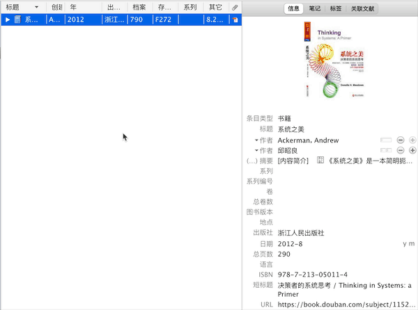
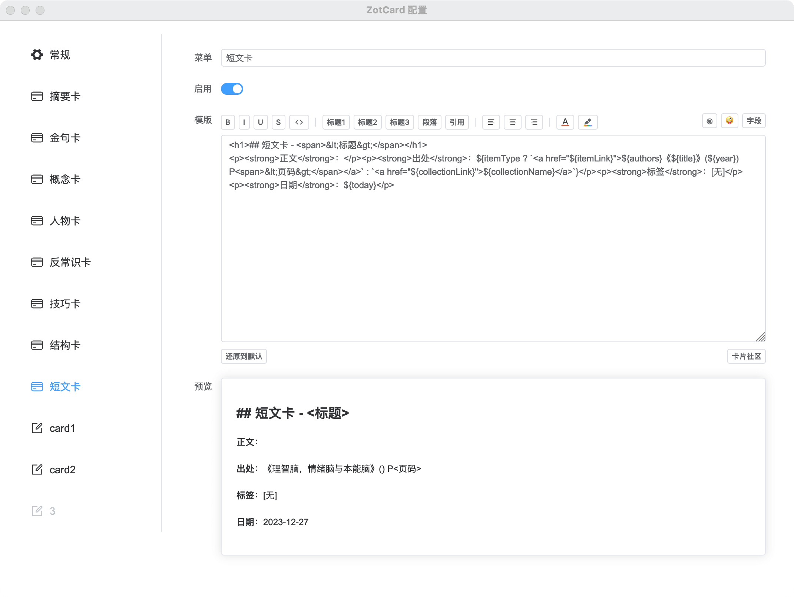
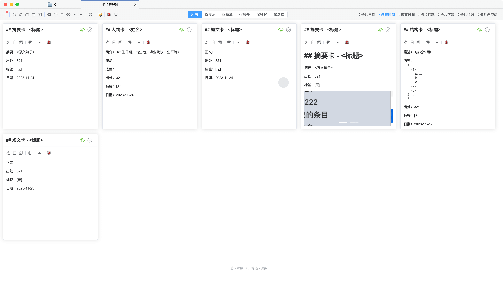
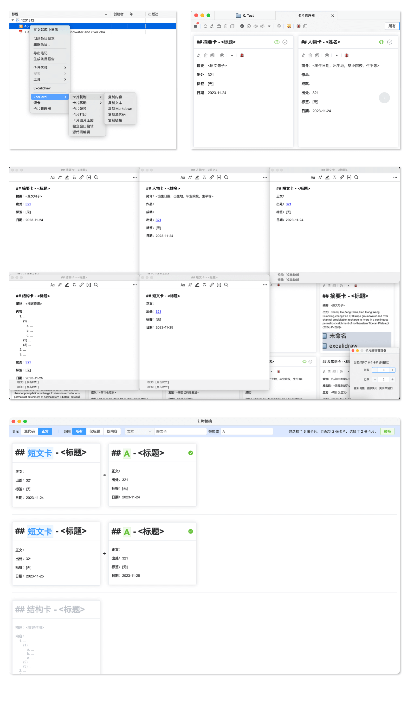
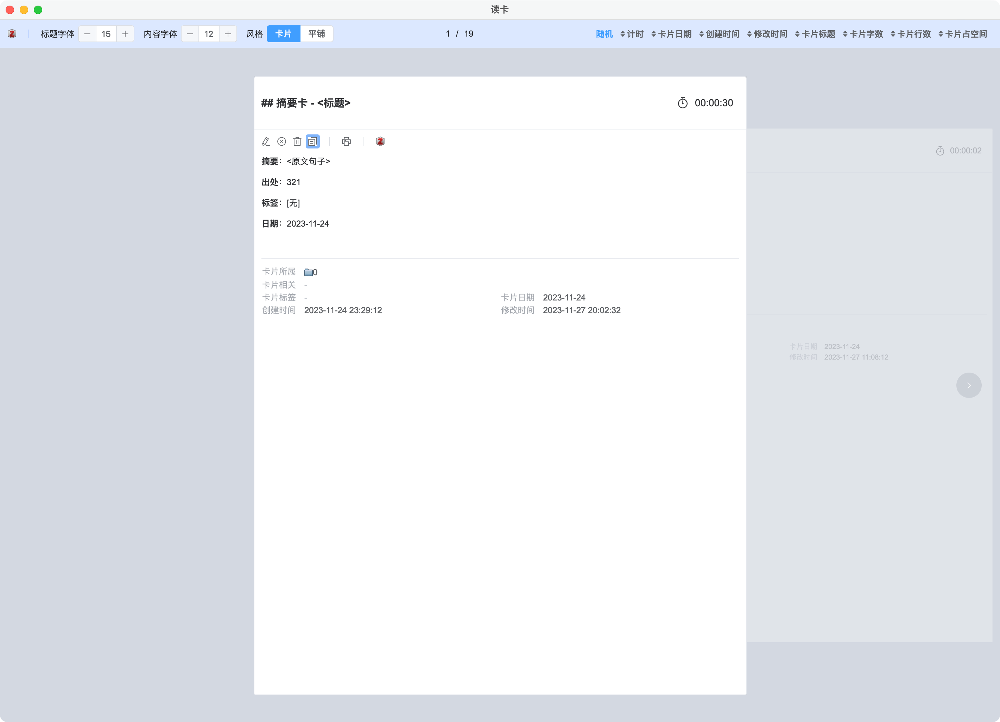
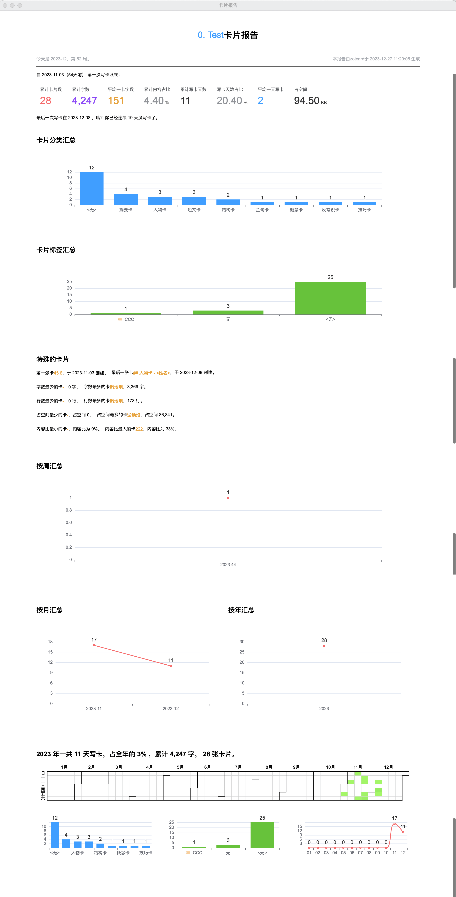

<p align="center">
  
</p>
<p align="center">
  <a href="https://www.zotero.org">
    
  </a>
  <a href="https://github.com/OrlandoZh/zotcardx/stargazers">
    
  </a>
  <a href="https://github.com/OrlandoZh/zotcardx/releases">
    
  </a>
</p>

[English](README.md) | 简体中文

## 介绍
ZotcardX 是基于原版 Zotcard、面向 Zotero 最新版本持续维护的版本。它是 Zotero 的一个插件，也是卡片法笔记的提效工具，提供卡片模版（如默认有概念卡、人物卡、金句卡等，支持自定义其他卡片模版），可以让你快速写卡。除此之外，还帮助你卡片分类以及统一卡片的标准格式。

## 快速开始
- 第一步、下载 ZotcardX 最新版本：[点击下载](https://github.com/OrlandoZh/zotcardx/releases)；

- 第二步、Zotero - 工具 - 附加组件 - ⚙️ - Install Add-on From File...，选择插件xpi文件；

- 第三步、在条目右键 - ZotcardX - 摘要卡，即可快速按模版创建卡片。

  

## 视频
- [bilibili](https://space.bilibili.com/404131635)

## 特性
- 快速建卡: 预置卡片模板，支持自定义卡片模块。

  

- 卡片管理: 卡片的基本操作，批量操作编辑、替换、复制、删除、移动、打印等等。

  

  

- 读卡: 随机读卡，还可以统计读卡时长。

  

- 卡片报告：统计自你写卡以来的卡片情况，包括分类汇总统计、标签汇总统计、周/月/年汇总统计、按年分析统计。

  
  
- 设置备份/还原/重置：在 Zotero Settings 的 ZotcardX 配置页中可以对 ZotcardX 设置进行备份/还原/重置。

## 高级

ZotcardX 给你提供更多的自定义卡片空间，但需要你懂一点点[HTML](https://www.runoob.com/html/html-tutorial.html)。

```html
<h1>## 金句卡 - <span>&lt;标题&gt;</span></h1>
<p><strong>原文</strong>：<span>${text ? text : "&lt;摘抄&gt;"}</span></p>
<p><strong>复述</strong>：<span>&lt;用自己的话复述&gt;</span></p>
<p><strong>启发</strong>：<span>&lt;有什么启发&gt;</span></p>
<p><strong>出处</strong>：${itemType ? `<a href="${itemLink}">${authors}《${title}》(${year}) P<span>&lt;页码&gt;</span></a>` : `<a href="${collectionLink}">${collectionName}</a>`}</p>
<p><strong>标签</strong>：[无]</p>
<p><strong>日期</strong>：${today}</p>
```

如需要插入 <，>，空格，&，"，'，换行，分割线等特殊字符可在「◉」插入。

如需要插入表情，可在「🤪」插入。

如需要插入Zotero的字段，可在「字段」插入。

  以下为复盘卡模版：

```html
<h3>## 复盘卡 - <span style="color: #bbbbbb;">&lt;标题&gt;</span></h3>\n
<p>- <strong>背景</strong>：<span style="color: #bbbbbb;">&lt;描述事情的背景，怎么引起的复盘。&gt;</span></p>
<p>- <strong>过程</strong>：<span style="color: #bbbbbb;">&lt;描述事情发送的过程，以及处理方式及结果。&gt;</span></p>
<p>- <strong>启发</strong>：<span style="color: #bbbbbb;">&lt;从此事情上得到什么启发，日后怎么改进。&gt;</span></p>
<p>- <strong>日期</strong>：{today}</p>
```

欢迎来这里寻找和分享你的卡片模版：[访问](https://github.com/OrlandoZh/zotcardx/discussions)。

## 致谢

ZotcardX 由 Oz 维护，是基于 018 的原版 [Zotcard](https://github.com/018/zotcard) 面向 Zotero 最新版本继续修复和维护的版本。感谢 018 以及原项目贡献者提供的基础和启发。

## 许可证

[MIT](./LICENSE)

Copyright (c) 2026 Oz
